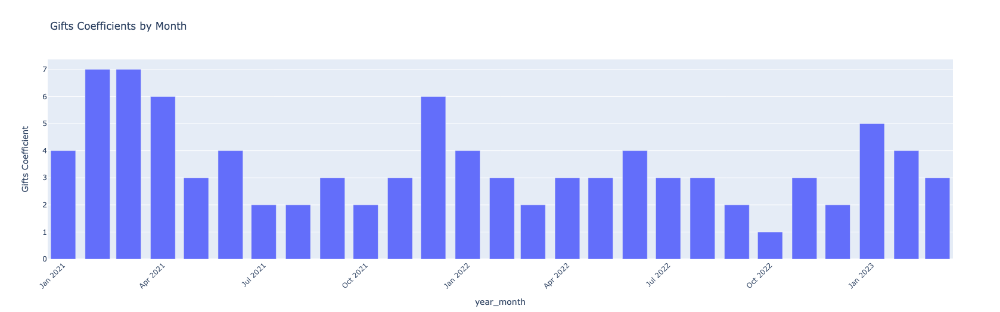

# Takflix — Customer & Sales Analytics for a VOD Streaming Platform

Customer behavior and loyalty analysis for **Takflix**, a video-on-demand (VOD) platform distributing Ukrainian films. The project merges raw ticket/transaction exports, builds customer-level purchase histories, and derives loyalty and monetization metrics (subscriptions, purchases, gifts, promo codes) to support marketing and retention decisions.

## Dataset

- **Input:** multiple `all_tickets (*).xlsx` exports (one file per batch), merged into a single dataset.
- **Final size:** 82,336 transactions × 13 columns after merging and cleaning.
- **Key columns:**
  - `ID`, `Created` — transaction ID and timestamp
  - `Film` — film title
  - `Owner's Email` — customer identifier (anonymized with synthetic values for this analysis)
  - `By SUB`, `By Gift`, `By Purchase`, `Free film` — flags indicating how the film was accessed (subscription, gift code, paid purchase, or free viewing)
  - `Promo code` — promo/subscription code used, if any
- Data spans from **January 2021 to March 2022** (verified for month completeness), no missing months in the observed range.

## Methods Used

| Stage | Technique / Library |
|---|---|
| Data ingestion | Merging multiple Excel exports into a single DataFrame (`pandas`, `openpyxl`) |
| Data cleaning | Missing value handling (`fillna`), datetime parsing, month-completeness check, anonymization of email addresses |
| Feature engineering | `year_month` period extraction; promo-code classification via string-prefix masks (`SUBC`, `SUB`, `8mm`, `16mm`) |
| Customer aggregation | Grouping by `Owner's Email` and `year_month`, pivoting into a cumulative purchase matrix |
| Loyalty analysis | Monthly **loyalty coefficient** (share of customers with more than one purchase among all active customers); segmentation into loyal (≥2 purchases) vs. one-time customers |
| Monetization analysis | **Gift coefficient** — ratio of gift-code redemptions to paid purchases, tracked by month |
| Recommendation insight | Building an email → watched-films mapping to identify the most popular films for a customer's **first** and **second** viewing |
| Visualization | Interactive bar charts of monthly loyalty and gift coefficients (`Plotly Express`) |

## Key Findings

- After cleaning, the merged dataset contains **82,336 transactions**; roughly **78,300 non-null records** remained usable after filtering.
- The overall **loyalty coefficient is ≈ 17%** — about 1 in 6 paying customers made a repeat purchase rather than a single one-off transaction.
- **8,797 customers** were classified as loyal (2+ purchases), together responsible for **≈ 51,600 total purchases**, showing that a relatively small loyal segment drives a large share of purchase volume.
- Monthly loyalty and gift coefficients fluctuate over time, revealing periods with stronger repeat engagement or heavier reliance on gift codes vs. paid purchases — useful signals for timing retention campaigns.
- The most-watched **first film** among loyal customers was *"Вхід через балкон"* (1,164 views), followed by *"Мої думки тихі"* (858) and *"Байконур. Вторгнення"* (472).
- For the **second film watched**, *"Мої думки тихі"* took the lead (693 views), ahead of *"Вхід через балкон"* (637) and *"Байконур. Вторгнення"* (607) — useful input for a "watch next" recommendation feature.

## Visualizations

### Gift Coefficient by Month



The gift coefficient shows clear peaks around December–January, reflecting the New Year tradition of buying gift codes for friends and family. Smaller spikes also appear near other holidays throughout the year, suggesting gift-code purchases generally rise around festive occasions. Outside these windows, the coefficient stays relatively stable, in the 2–4 range, indicating that holidays are the main driver of gifting activity — a useful signal for timing future gift-code marketing campaigns.

## Repository Structure

```
.
├── Takflix.ipynb        # main analysis notebook
├── requirements.txt     # Python dependencies
├── gift_coeff.png       # gift coefficient chart used in this README
└── README.md
```

## Installation

```bash
python -m venv venv
source venv/bin/activate      # Windows: venv\Scripts\activate
pip install -r requirements.txt
```

## Usage

1. Place the source `all_tickets (*).xlsx` export files in the working directory.
2. The notebook was originally written for **Google Colab** and uses `google.colab.files.upload()`. For local execution, replace the upload cell with direct file reads, e.g.:

   ```python
   import glob
   dfs = [pd.read_excel(f, engine='openpyxl') for f in glob.glob('all_tickets*.xlsx')]
   ```

3. Launch Jupyter and run the cells sequentially:

   ```bash
   jupyter notebook Takflix.ipynb
   ```

## Notes & Limitations

- The `Owner's Email` column is replaced with randomly generated placeholder values in this notebook to anonymize customer data before sharing/publishing.
- A couple of cells reference variables (e.g. `loyal_clients_list`) that are not explicitly defined earlier in the visible flow — review the notebook end-to-end before rerunning from scratch.
- The analysis focuses on transaction-level loyalty and content popularity; it does not yet include revenue/pricing data or churn prediction, which would be natural extensions.
